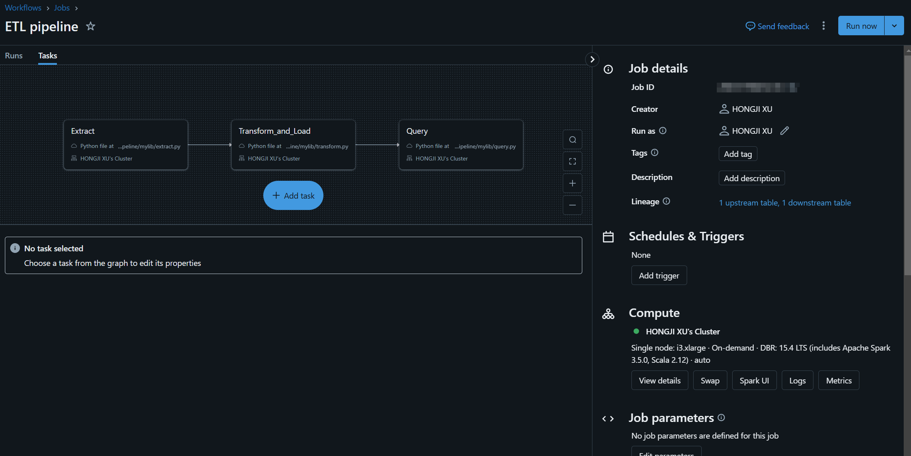
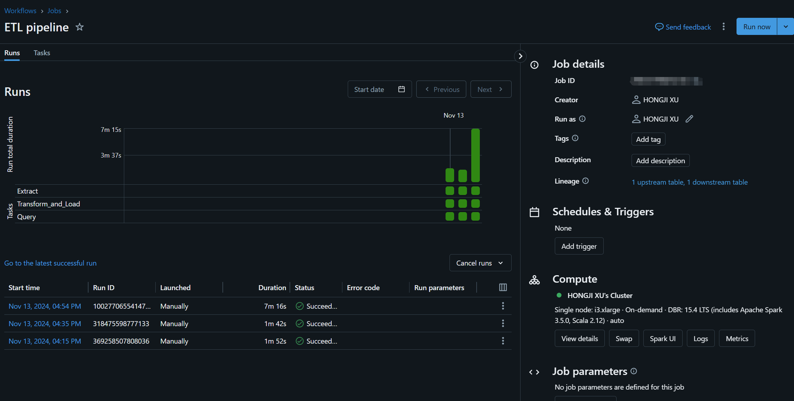
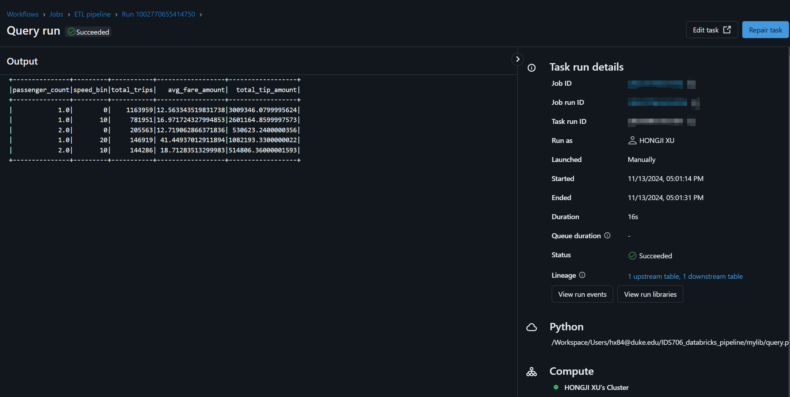

# IDS706_databricks_pipeline


## Data Pipeline
I create a ETL process using databrick, core scripts are in [mylib](./mylib/)

## Documentation of Databricks

### Overview

There are three tasks in this pipeline:



### Runs



### Pipeline Output



## CICD

I used Databricks CLI in CICD to automatically trigger the pipeline workflow in the databricks:
```bash
    - name: Run Databricks Pipeline
      env:
        DATABRICKS_HOST: ${{ secrets.DATABRICKS_HOST }}
        DATABRICKS_TOKEN: ${{ secrets.DATABRICKS_TOKEN }}
        DATABRICKS_JOB_ID: ${{ secrets.DATABRICKS_JOB_ID }}
      run: |
        databricks configure --host $DATABRICKS_HOST --token $DATABRICKS_TOKEN
        databricks jobs run-now --job-id $DATABRICKS_JOB_ID
```

## Explanation of Functions

Here are explaction of each script in mylib:

### 1. `extract.py`

This scripts downloads the Parquet file(300MB+) from a specified URL, reads it into a Pandas DataFrame, and saves it as a temp CSV file.

```python
import requests
import pandas as pd
from io import BytesIO

def extract(parquet_url="https://d37ci6vzurychx.cloudfront.net/trip-data/yellow_tripdata_2024-01.parquet", output_csv_path="/dbfs/yellow_tripdata_2024-01.csv"):
    response = requests.get(parquet_url, stream=True)
    if response.status_code == 200:
        parquet_data = BytesIO(response.content)
        print("Parquet file downloaded successfully.")
    else:
        print("Failed to download the Parquet file.")
        return

    # Read the Parquet file with Pandas
    df = pd.read_parquet(parquet_data)

    # Save DataFrame as CSV
    df.to_csv(output_csv_path, index=False)
    print(f"Data successfully saved as CSV at {output_csv_path}")

if __name__ == "__main__":
    extract()
```

### 2. `transform.py`

This scripts load the temp csv download by extract.py and performs several transformations on the dataset:
- **Calculate Trip Duration**: Computes the time difference between pickup and drop-off times in minutes.
- **Calculate Average Speed**: Calculates average speed (miles per hour) based on trip distance and duration.
- **Filter Data**: Removes entries with invalid trip distances or speeds.
- **Bin Speed**: Categorizes the data into speed bins (e.g., 0-10 mph, 10-20 mph) for easier analysis.
And finally save it as a table using data sinck:
```python
    df_binned.write.format("delta").mode("overwrite").saveAsTable(table_name)
```

```python
import os
from pyspark.sql import SparkSession, functions as F

def transform(spark, file_path="/yellow_tripdata_2024-01.csv", table_name="taxi_trips"):
    df = spark.read.csv(file_path, header=True, inferSchema=True)
    
    df_with_duration = df.withColumn(
        'trip_duration',
        (F.unix_timestamp('tpep_dropoff_datetime') - F.unix_timestamp('tpep_pickup_datetime')) / 60
    )
    
    df_with_speed = df_with_duration.withColumn(
        'average_speed',
        F.when(F.col('trip_duration') > 0,
               F.col('trip_distance') / (F.col('trip_duration') / 60)
        ).otherwise(None)
    )
    
    df_filtered = df_with_speed.filter(
        (F.col('trip_distance') > 0) &
        (F.col('trip_duration') > 0) &
        (F.col('average_speed') >= 1) &
        (F.col('average_speed') <= 100)
    )
    
    df_binned = df_filtered.withColumn(
        'speed_bin',
        (F.floor(F.col('average_speed') / 10) * 10).cast('int')
    )
    
    # save it as a table using data sink
    df_binned.write.format("delta").mode("overwrite").saveAsTable(table_name)
    print(f"Data successfully saved as table '{table_name}'")

from pyspark.sql import SparkSession

if __name__ == "__main__":
    spark = SparkSession.builder.appName("TripDataAnalysis").getOrCreate()
    transform(spark)

```

### 3. `query.py`

This script uses Spark SQL to perform an aggregate analysis of the transformed data from the saved table 'total_trips'.

```python
def query(spark, table_name="taxi_trips"):
    query = f"""
    SELECT
        passenger_count,
        speed_bin,
        COUNT(*) AS total_trips,
        AVG(fare_amount) AS avg_fare_amount,
        SUM(tip_amount) AS total_tip_amount
    FROM
        {table_name}
    GROUP BY
        passenger_count,
        speed_bin
    ORDER BY
        total_trips DESC
    LIMIT 5
    """
    
    result = spark.sql(query)
    result.show()

from pyspark.sql import SparkSession

if __name__ == "__main__":
    spark = SparkSession.builder.appName("TripDataAnalysis").getOrCreate()
    query(spark)
    
```

## Output

The script’s output includes the top 5 combinations of passenger count and speed bin, with their respective statistics, displayed in the console. The output format will resemble:

```
+---------------+---------+-----------+------------------+------------------+   
|passenger_count|speed_bin|total_trips|   avg_fare_amount|  total_tip_amount|
+---------------+---------+-----------+------------------+------------------+
|            1.0|        0|    1163959|12.563343519831738|3009346.0799995624|
|            1.0|       10|     781951|16.971724327994853|2601164.8599997573|
|            2.0|        0|     205563|12.719062866371836| 530623.2400000356|
|            1.0|       20|     146919| 41.44937012911894|1082193.3300000022|
|            2.0|       10|     144286| 18.71283513299983|514806.36000001593|
+---------------+---------+-----------+------------------+------------------+
```